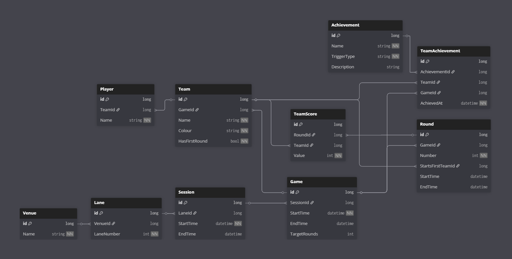

# Ice And Stone
*A Proof of Concept curling-inspired game built with Unity, .NET 8 API, and MySQL.*
<p align="center">
  <a href="https://github.com/John-JonSteyn/IceAndStone/stargazers" target="_blank" rel="noopener noreferrer">
    
  </a>
  <a href="https://github.com/John-JonSteyn/IceAndStone/network/members" target="_blank" rel="noopener noreferrer">
    
  </a>
  <a href="https://github.com/John-JonSteyn/IceAndStone" target="_blank" rel="noopener noreferrer">
    
  </a>
  <a href="https://github.com/John-JonSteyn/IceAndStone/commits/main" target="_blank" rel="noopener noreferrer">
    
  </a>
  <a href="https://github.com/John-JonSteyn/IceAndStone/issues" target="_blank" rel="noopener noreferrer">
    
  </a>
  <a href="https://github.com/John-JonSteyn/IceAndStone/blob/main/LICENSE" target="_blank" rel="noopener noreferrer">
    
  </a>
</p>

---

## Overview
**Ice And Stone** is a digital Proof of Concept (PoC) for the sport of Curling, commissioned by **SportIt**.  
It demonstrates how players can join a game, take turns sliding stones, record live scores, and view leaderboards on-screen.

The project is designed to show investors the *potential of gamifying curling* in a bowling-alley-like setup, with:
- **Unity 6 URP (Windows)** – Game & UI  
- **.NET 8 Web API** – Player management & scores  
- **MySQL Database** – Persistent storage for players, games, and leaderboards  

---

## Features
- Player registration via touchscreen input  
- Turn-based gameplay with realistic stone physics  
- Live leaderboard visible throughout the match  
- Final podium for Gold, Silver, and Bronze winners  
- Auto-reset for new games  
- Clean architecture with API + DB integration  

---

## Tech Stack
- **Unity 6 URP** (Game Application)  
- **.NET 8** (Backend Web API)  
- **MySQL** (Database)  
- **GitHub** (Version control with branching strategy)  

---

## Getting Started

### Clone the repo
```bash
git clone https://github.com/John-JonSteyn/IceAndStone.git
cd IceAndStone
````

### Unity Project

Open `unity-app/` in **Unity 6 URP (Windows target)**.
Run the scene `Main.unity` to start the PoC.

### Backend API

Navigate to `api/` and run:

```bash
dotnet run
```

API endpoints will be available at: `http://localhost:5000/swagger`

### Database

* Install MySQL
* Run scripts inside `db/schema.sql`
* Configure `appsettings.json` in the API with your MySQL credentials

---

## 🔗 API Endpoints (Sample)

* `POST /player/join` → Add player
* `POST /game/score` → Record score
* `GET /leaderboard/current` → Get leaderboard
* `POST /game/reset` → Reset for next round

---

## Database Schema

The Ice And Stone project uses a relational MySQL schema to manage venues, sessions, games, teams, rounds, team scores, and achievements.

### Visual ERD


### Schema Definition
The schema is also defined using [dbdiagram.io](https://dbdiagram.io/) format in [`Docs/ERD.sql`](Docs/ERD.sql).

Here’s an excerpt showing how games, rounds, and team scores are represented. These tables form the backbone of scorekeeping:
```sql
Table Game {
  id           long [pk]
  SessionId    long [ref: > Session.id]
  StartTime    datetime [not null]
  EndTime      datetime
}

Table Round {
  id                 long [pk]
  GameId             long [ref: > Game.id]
  Number             int  [not null, note: "1-based per game"]
  StartsFirstTeamId  long [ref: > Team.id]
}

Table TeamScore {
  id        long [pk]
  RoundId   long [ref: > Round.id]
  TeamId    long [ref: > Team.id]
  Value     int  [not null, note: "Points earned this round"]
}
```

---

## License

This project is licensed under the **Creative Commons Attribution-NonCommercial 4.0 (CC BY-NC 4.0)** License.
See the [LICENSE](./LICENSE) file for details.
